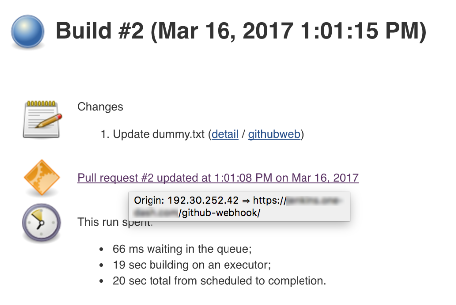

Jenkins Branch API Plugin
===

This plugin provides an API for multiple branch based projects.

The following concepts are provided:

-   Multibranch projects: projects consisting in a group of several
    projects, one for each defined branch.
-   Organizational folders: a folder-like collection of Multibranch
    projects, one per repository.
-   Branch properties: add additional information linked to the branch,
    which can then be used to take decisions. Some properties are
    provided:
    -   Do not trigger builds for branch.
    -   Do not trigger builds for organizational folder.
    -   Override triggering behaviour for multibranch project or
        organizational folder.
    -   Untrusted author.
    -   Limit builds for a branch to a certain rate.
    -   Discard old builds for branch.

For generic information about how to use the Branch API plugin, please see [the user guide](docs/user.adoc)

If you are writing a plugin that implements this API, please see [the implementation guide](docs/implementation.adoc)
 
# Environment

The following build environment is required to build this plugin

* `java-1.8` and `maven-3.3.9`

# Build

To build the plugin locally:

    mvn clean verify

# Release

To release the plugin:

    mvn release:prepare release:perform -B

# Test local instance

To test in a local Jenkins instance

    mvn hpi:run

# Debug hooks for events

If you have to try and diagnose issues with events or indexing, the
following information may be of assistance:

Jobs triggered by SCM Events try to capture their origin.

The origin is available as a tool-tip on the build cause:  
  

This can be very helpful to quickly identify where events that trigger
builds are coming from.

More detailed event processing information is available from the event
logs.  
 

By default, the CloudBees Folders plugin will only retain the logs of
the last scan / index. If you are having issues with scanning /
indexing, it can help to turn on the retention with the system
property `com.cloudbees.hudson.plugins.folder.computed.FolderComputation.BACKUP_LOG_COUNT`
(note that you can write directly to that field using the System Groovy
Console, so you can change the value on a running system without a
restart)

The Multi-branch projects will log the initial arrival of events and any
routing decisions in
the `$JENKINS_HOME/logs/jenkins.branch.MultiBranchProject.log` file
(which will be rolled every 32kB, limit of 5 files)

-   Once an event has been routed to a specific Multi-branch project,
    the responsibility for logging the event will belong with that
    Multi-branch project and will be stored in the
    `$JENKINS_HOME/jobs/$PATH_TO_PROJECT/indexing/events.log` (which
    will be rolled every 150kB, limit of `BACKUP_LOG_COUNT` files)

The Organization folder projects will log the initial arrival of events
and any routing decisions in
the `$JENKINS_HOME/logs/jenkins.branch.OrganizationFolder.log`
file (which will be rolled every 32kB, limit of 5 files)

-   Once an event has been routed to a specific Organization folder
    project, the responsibility for logging the event will belong with
    that Organization folder project and will be stored in the
    `$JENKINS_HOME/jobs/$PATH_TO_PROJECT/computation/events.log` (which
    will be rolled every 150kB, limit of `BACKUP_LOG_COUNT` files)
