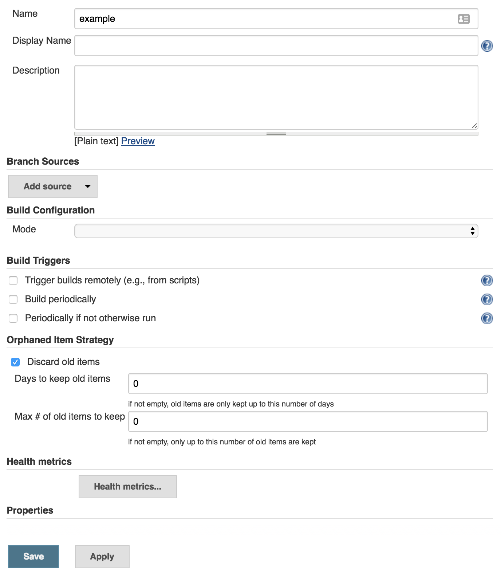
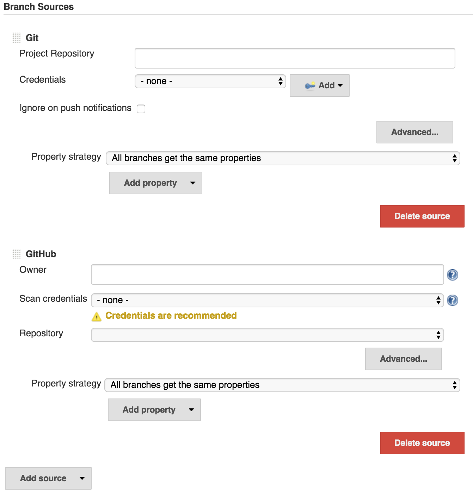

== User guide

This document provides the user guide to the functionality provided by the Branch API plugin.

The Branch API plugin is a framework for one solution to the problem of how synchronize Jenkins with the branching structure of your source control system.
The solution that the Branch API plugin provides will automatically create projects for branches and tidy them up based on the criterial you configure.
The Branch API plugin also provides a framework for another layer of abstraction above this, namely that Jenkins will be synchronized with a collection of repositories and will create multi-branch projects for each repository as those repositories meet the criteria required to manage them as multi-branch projects.

In order to use the Branch API plugin, you need to also have installed two other kinds of plugins:

* You need a plugin that implements the http://wiki.jenkins-ci.org/display/JENKINS/SCM+API+Plugin[SCM API] for your source control system.
+
There are two levels of implementation that a plugin may observe:
+
--
. Implementation of `SCMSource` only -- this will allow the use of the multi-branch project functionality in Branch API.
. Implementation of `SCMSource` and `SCMNavigator` -- this will allow the use of both the multi-branch project and organization folder functionality in Branch API.
--
+
Some examples:
+
--
* https://wiki.jenkins-ci.org/display/JENKINS/GitHub+Branch+Source+Plugin[GitHub Branch Source Plugin] -- provides both `SCMSource` and `SCMNavigator`
* https://wiki.jenkins-ci.org/display/JENKINS/Bitbucket+Branch+Source+Plugin[Bitbucker Branch Source Plugin] -- provides both `SCMSource` and `SCMNavigator`
* https://wiki.jenkins-ci.org/display/JENKINS/Mercurial+Plugin[Mercurial Plugin] -- provides `SCMSource` only
* https://wiki.jenkins-ci.org/display/JENKINS/Git+Plugin[Git Plugin] -- provides `SCMSource` only
* https://wiki.jenkins-ci.org/display/JENKINS/Subversion+Plugin[Subversion Plugin] -- provides `SCMSource` only
--
+
NOTE: Check with the documentation for your SCM API provider plugin to see how to configure that plugin's `SCMSource` / `SCMNavigator` implementations.

* You need a plugin that implements the Branch API.
+
Some examples:
+
--
* The https://wiki.jenkins-ci.org/display/JENKINS/Literate+Plugin[Literate plugin] stores the job configuration in a file (`README.md`) in source control directly in the branch.
+
Thus if the one branch uses a different build process then the configuration for that branch can live within that branch.
+
The type of build configuration supported by the literate plugin is, as a result of the configuration file format, restricted to shell steps and publishers.
+
The literate plugin also follows the principle of keeping all job configuration in the branch to which it relates.
This means if you want to change one aspect of the build process in multiple branches at the same time, you need to explicitly replicate the changes to all the branches.
Whether this is an advantage or disadvantage depends on your point of view.

* The https://wiki.jenkins-ci.org/display/JENKINS/Pipeline+Multibranch+Plugin[Pipeline Multibranch plugin] also stores the job configuration in a file (`Jenkinsfile`) in source control directly in the branch.
+
That file can reference lightweight "plugins" in the form of https://wiki.jenkins-ci.org/display/JENKINS/Pipeline+Shared+Groovy+Libraries+Plugin[shared groovy libraries].
This allows for a Jenkins administrator to split some reusable best practices into a shared library.
Changing the best practice in the global shared library can then affect all the branches simultaneously -- or if the shared library version was pinned you would need to push the library version update to the required branches.
--
+
NOTE: Check with the documentation for the Branch API provider plugin to see how to configure that plugin's `MultiBranchProject` / `MultiBranchProjectFactory` implementations.

The remainder of this document focuses on the generic functionality provided by the Branch API plugin itself.

=== Multi-branch projects

The configuration screen for a multi-branch project should look something similar to the following

.A basic multi-branch project configuration screen.

The _Name_, _Display Name_ and _Description_ fields are common with all Jenkins item types.

The _Branch Sources_ section is where you configure the `SCMSource` implementation(s) from your SCM API provider plugin to identify the repository / repositories that will be indexed to identify branches to build.

Branch sources are an order list of `SCMSource` implementations and the associated property strategy to apply to branches from that source.
If two branch sources report a branch with the same name, the first branch source in the ordered list wins.

.Two branch sources. The Git branch source will have higher priority over the GitHub branch source as the Git source is above the GitHub source.

You can use the handles to drag and drop the sources to put them in the order that you require.

The _Build Configuration_ section may or may not be present -- this depends on whether the multi-branch project type allows configuration of the way the per-branch projects are detected and configured.
For example, the pipeline multibranch project allows jobs to be created using a strategy that:

* provides a single fixed fixed pipeline definition for all branches that contain a user configured marker file.

* provides a pipeline definition from the branch itself for all branches that contain a file called `Jenkinsfile`.

The _Build Triggers_ section is similar to the standard build triggers in Jenkins jobs.
The build triggers control how often a full indexing scan is performed on the branch sources.

TIP: It is recommended to configure the _Periodically if not otherwise run_ trigger to run either once a day or once a week in order both to ensure that the orphaned item strategy gets applied and to ensure that any missed events from the tracked source control systems get picked up eventually.

The _Orphaned Item Strategy_ is similar to the build retention strategy used in Jenkins jobs but applies to the branch specific jobs themselves.
The strategy is only ever applied during a full indexing of the multi-branch project. If any branches no longer exist in the backing sources then those branches are considered orphaned.

TIP: Individual orphaned items can be manually deleted proactively ahead of the orphaned item strategy.

The _Health metrics_ section allows configuration of how the health metrics of this folder are reported to higher levels.
See the https://wiki.jenkins-ci.org/display/JENKINS/CloudBees+Folders+Plugin[Folders Plugin] documention for details of this.

Finally the _Properties_ section includes both generic folder properties and properties specific to this type of multi-branch project

=== Organization folders

=== Branch properties

==== Discard old builds

==== Suppress automatic SCM triggering

==== Throttle builds

==== Untrusted

=== Branch property strategies

==== All branches get the same properties

==== Named branches get different properties
